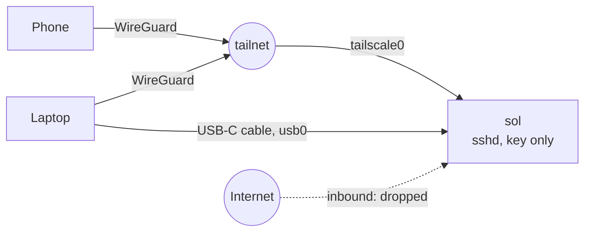

# sol

A Raspberry Pi 4 brought up from the bootloader into an always-on, headless ARM64 box: one reproducible setup run, private remote access, and diagnostics that measure instead of guess.

[](https://github.com/awisecom/sol/actions/workflows/ci.yml)

- **One idempotent bootstrap.** Eleven steps take a fresh Raspberry Pi OS Lite install to the finished box. Each step checks the current state before touching anything, so a second run reports 0 changes.
- **The dry run shows the diff.** `--dry-run` prints every file it would change as a unified diff and every command it would run. Files holding secrets are never printed.
- **Nothing listens on the internet.** SSH is key-only, reachable over Tailscale or a USB-C cable. Everything else inbound is dropped.
- **It can't lock you out.** Password logins stay on until a key is installed. The sshd and nftables configs are validated before they are applied, and rolled back if rejected.
- **It measures the hardware.** `pi-doctor` decodes the throttling and under-voltage bits, checks the card, boot time, failed units and the network. `sdbench` is what found this box's first SD card reading at 14.6 MB/s.
- **Backups that get restored.** Nightly restic snapshots, a weekly integrity check, and a restore test that compares restored files with the live ones.

## Quick start

On a fresh Raspberry Pi OS Lite (64-bit) install:

```bash
git clone https://github.com/awisecom/sol.git && cd sol
cp sol.env.example sol.env && chmod 600 sol.env    # hostname, user, SSH key, Wi-Fi, backups
bash bootstrap.sh --dry-run                        # every planned change as a diff; touches nothing
sudo bash bootstrap.sh                             # apply; safe to re-run
sudo bash tools/pi-doctor                          # health report
```

`--only ssh,firewall` and `--skip backup` run a subset; `--list` shows the steps.

## The steps

| Step | What it does | Why |
|---|---|---|
| `preflight` | Identifies the board and OS, checks `sol.env` | Fail before changing anything |
| `system` | Hostname, timezone, locale, Wi-Fi country | An unset country keeps the radio soft-blocked: boots fine, no Wi-Fi |
| `packages` | Baseline tools (tmux, git, fio, nftables, avahi) | Refreshes the apt index only when it is over 6 h old |
| `updates` | Unattended Debian updates | Kernel and firmware stay manual: a bad boot on a headless box needs a screen |
| `ssh` | Installs the key, then a hardened sshd drop-in | Lockout guard, `sshd -t` before reload, rollback on failure |
| `firewall` | nftables, inbound policy drop | Replaces only its own table, so Tailscale's chains survive a reload |
| `network` | Wi-Fi profiles as NetworkManager keyfiles, by priority | Root-only files; the password never appears in `ps`. Detects captive portals |
| `usb-gadget` | `dwc2` + `g_ether`, shared-mode network on `usb0` | A way in over a USB-C cable with no network at all |
| `sd-wear` | Journal in RAM on SD, low swappiness, `noatime` | Fewer small writes to flash. Picks persistent logs automatically when booting from USB |
| `remote-access` | Tailscale from the vendor's signed apt repository | No port forwarding, works behind NAT and client isolation |
| `backup` | restic with systemd timers, retention, weekly check and restore test | A backup only counts once something has been restored from it |

Every config the steps install is a template in [`config/`](config/), rendered with values from `sol.env`. Drop-in directories (`sshd_config.d`, `journald.conf.d`, `sysctl.d`, `apt.conf.d`) are used wherever the service supports them, so package upgrades never fight with local edits.

## How you reach it



More in [docs/remote-access.md](docs/remote-access.md), including what guest and hotel Wi-Fi does to a headless box.

## pi-doctor

Example from the SD-card days, abridged:

```text
$ sudo bash tools/pi-doctor --bench
pi-doctor  sol  2026-09-17 21:40

power and heat
  ok    throttling      none (0x0)
  ok    temperature     47.7 °C
storage
  ok    root            /dev/mmcblk0p2 (sd), 62.5 GB, 9% used
  ok    mount           noatime
  ok    I/O errors      none in the kernel log since boot
  fail  read speed      14.6 MB/s from /dev/mmcblk0: far below a healthy card (40-90 MB/s): expect slow boots and timeouts
network
  ok    internet        generate_204 answered 204
  ok    tailscale       on the tailnet
security
  ok    ssh passwords   off
  ok    firewall        table inet sol loaded

21 ok, 0 warning(s), 1 failure(s)
```

Exit code 0, 1 or 2, so it drops straight into a cron job or a monitoring check. `--json` gives the same results machine-readable.

## How it came up

The first boot failed with no green LED activity at all. Reading the LEDs, updating the EEPROM, measuring the card end to end (18.9 GB at 14.6 MB/s, zero errors) and finding a soft-blocked radio took one evening. The log, step by step: [docs/bringup-log.md](docs/bringup-log.md). Background on each boot stage: [docs/boot-chain.md](docs/boot-chain.md). Day-two operations: [docs/runbook.md](docs/runbook.md).

## Layout

```text
bootstrap.sh          entry point: --dry-run, --only, --skip, --list
lib/common.sh         perform/edit_file, the file filters, package and service helpers
lib/pi.sh             throttle decoding, size and speed maths, verdicts
lib/step-runner.sh    runs one step in its own bash process
steps/NN-name.sh      one step per file, in order
config/               templates for everything the steps install
tools/pi-doctor       health report
tools/sdbench         storage benchmark and full-surface scan
tools/restore-test    restores from the latest snapshot and compares with the live files
tests/                bats suite and the CI fixture
```

## Tests

`make check` runs shellcheck over every script and 52 bats tests: each file filter (cmdline.txt stays one line, the `config.txt` section logic, fstab, locale.gen), template rendering, dry-run behaviour, the throttle decoder, the tools against disk images, and a full dry run of all steps. CI runs the same on Ubuntu 24.04, where the Pi-only steps skip themselves.

---

Built for one machine, mine: Raspberry Pi 4, Raspberry Pi OS Lite 64-bit (Debian 13). Shared to show how I work. © 2026 Aleksander Wisniewski, all rights reserved.
