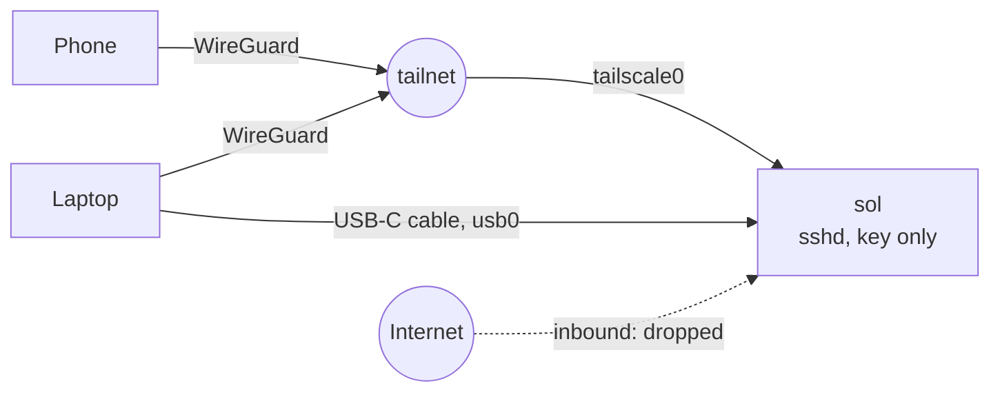

# Remote access without open ports

Goal: reach sol from a phone or laptop from anywhere, while nothing on it listens to the internet.

## Three ways in

1. **Tailscale.** A WireGuard mesh. Both ends dial out to the coordination server and then to each other, with a relay when no direct path exists. That works behind NAT, on mobile data and on guest Wi-Fi that isolates clients. The firewall accepts SSH on `tailscale0`.
2. **USB-C cable.** With `dwc2` and `g_ether` loaded, the Pi shows up on a laptop as a USB network adapter. NetworkManager's shared mode gives the Pi `10.42.0.1` and hands the laptop an address, so `ssh admin@10.42.0.1` works with no Wi-Fi and no router. The laptop port also powers the Pi, which is fine for a shell, not for heavy load.
3. **LAN SSH, during bring-up only.** `SOL_SSH_FROM_LAN=yes` adds a rule for `eth0` and `wlan0`. Set it to `no` and re-run `bootstrap.sh --only firewall` once the first two work.

In all three cases sshd accepts keys only, for one user, with no root login.

## The firewall

`config/nftables.conf` sets the input policy to drop and accepts: loopback, replies to connections the Pi opened, the ICMP that IPv4 and IPv6 need, SSH on the trusted interfaces, mDNS, Tailscale's direct-connection port, and DHCP and DNS on the USB link. Dropped packets are logged, rate-limited to five a minute.

It replaces only its own table (`inet sol`) on reload. A `flush ruleset` would also delete the chains that tailscaled installs, and those only come back when tailscaled restarts.

## Guest and hotel Wi-Fi

| Problem | What you see | What handles it |
|---|---|---|
| Wi-Fi country not set | Pi boots, no Wi-Fi at all, radio soft-blocked | `system` step sets the country; `pi-doctor` fails on a blocked radio |
| Client isolation | `sol.local` doesn't resolve, SSH times out on the same network | Tailscale: both ends dial out |
| Captive portal | connected, no internet | detected via `generate_204` and reported. Log in through the portal from a laptop on the USB cable link, or ask the network owner to allow the device |
| Network gone | nothing | USB-C cable |

`generate_204` returns HTTP 204 with an empty body. Any other answer means something between the Pi and the internet rewrote the request, which on guest networks is almost always a portal.
